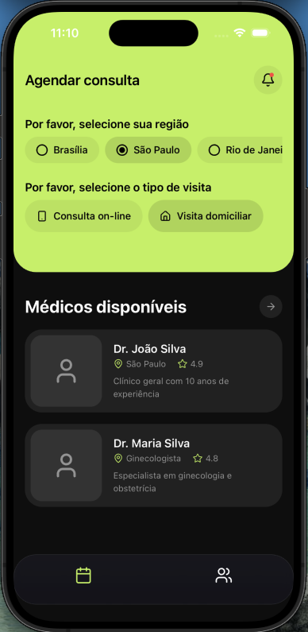
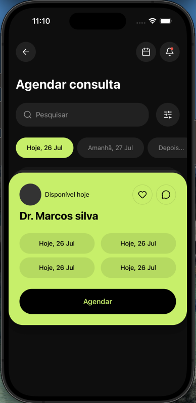
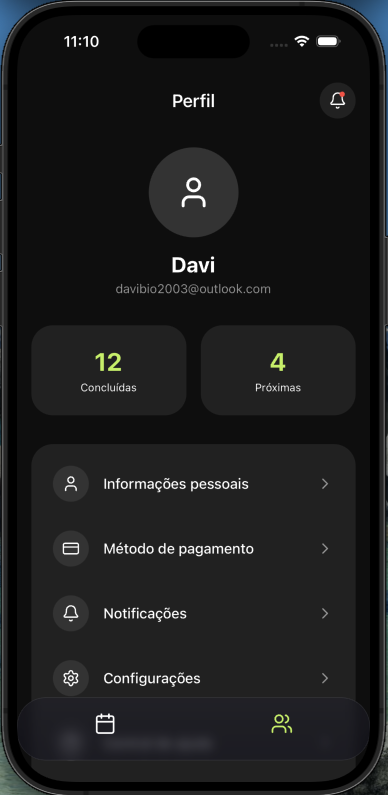

# Doctor Booking App

Um aplicativo móvel construído em React Native + TypeScript.

## Como executar o projeto localmente

Certifique-se de que o **Node.js** e o **Git** estejam instalados em sua máquina.

### Passos Gerais

1.  Acesse o diretório do projeto:
    ```bash
    cd doctor-app
    ```
2.  Instale as dependências:
    ```bash
    npm install
    ```

### Como testar no macOS (Simulador iOS)

O jeito mais fácil de rodar no macOS é utilizando o **Xcode**.
1. Instale o Xcode pela Mac App Store.
2. Inicie o simulador rodando no seu terminal:
    ```bash
    npm run ios
    ```
3. O Metro iniciará e compilará o app diretamente para o simulador do iPhone.

### Como testar no Windows (Simulador Android)

Para compilar em ambiente Windows, você deve utilizar o **Android Studio**.
1. Instale o Android Studio e verifique se você tem pelo menos um Dispositivo Virtual (AVD) configurado.
2. Com o emulador Android aberto (ou o seu celular conectado em modo depuração USB), execute:
    ```bash
    npm run android
    ```
3. O app compilará o APK local e rodará direto no simulador/dispositivo.

*(Nota: Você também pode usar o Expo Go no celular escaneando o QR Code que vai aparecer no terminal após iniciar o npm start)*

## Telas (Screenshots)

### Calendário & Médicos (Home)


---

### Agendamento


---

### Perfil
